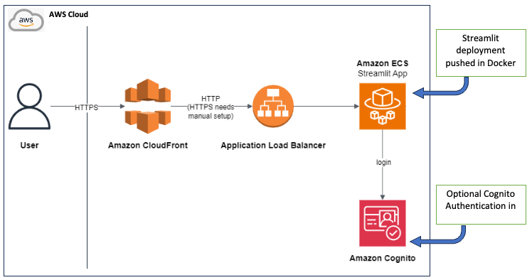

# Expanding Agile beyond Product development 🚀
The true spirit of Agile is achieved when we are able to implement it truly end-2-end. Agile has to push its boundary beyond just the product development. The requirement to solve business problems are undergoing a radical transition towards deliver solutions at higher pace while keeping the pulse on the requirements right. AI led development and Infrastructure as Code (e.g., CDK) have made it easy for the **Product and Technical Program Managers** to implement Agile during product design phase itself. By the time Machine learning scientists would have worked a protoype of a solution, they need cloud native components ready to support the run. Experimental products are getting closer to production product. The 80-20 rule applies: while 20% of business problems demand complex, long-term solutions, the vast majority (80%) require quick, tailored solutions built to last for a specific time interval.
Traditional product design methodology - wireframes and mockups offer valuable feedback, but they don't truly test the functionality or effectiveness of a solution. Getting a working prototype in front of users quickly is crucial for gathering actionable insights—especially when time is of the essence. AI is now enabling us to bypass traditional product exploration bottlenecks and get straight to working solutions—continuously exploiting the Agile values and principle.

My focus with this project was on rapidly deploying the trained model (**_within half a day ~ 4 hours_**) and setting up the necessary supporting components, that iteratively helps the users to define the product. This project demonstrates how these new methodologies can significantly reduce the time required to deploy a locally trained AI solution tailored to a specific use case. By streamlining the deployment process, we can rapidly deliver working solutions for the 80% of business problems that need them now. This allows product managers to validate hypotheses more quickly, adapt to user needs more effectively, and deliver value faster than ever before. It empowers product managers to get real-world feedback on working prototypes earlier in the development cycle, enabling data-driven decision-making and faster time-to-market for targeted solutions.  

This project utilizes a modern approach to deploying AI solutions, leveraging key components:
* **Docker**: Containerizing the locally trained AI model for consistent execution and easy deployment. 📦   
* **Orchestration (Fargate/ECS)**: Managing the containers for scalability and reliability, allowing us to adapt quickly to changing demands. 🕺   
* **Connectivity (Internet Gateway/Load Balancers)**: Enabling secure and accessible endpoints, crucial for rapid user testing. 🚦
* **Security (Cognito - OPTIONAL)**: Implementing user authentication and authorization, ensuring data security from the start. 🕶️
* **User Interface (Streamlit)**: Building a simple user interface for interaction with the AI, prioritizing speed of development. 🕹️
* **Development Aid (e.g., Amazon Q)**: Connecting to a knowledge base for information retrieval, enabling quick access to relevant data for specific use cases. 📚
* **Core Language (Python)**: Chosen for its versatility and speed in the AI domain. 🐍  
* **AWS CDK** – The backbone for the Infrastructure as a Code.

## Demo Page


# Deploying the streamlit app

This app can be used as a starting point to easily create and deploy a GenAI demo, with web interface and user authentication. It is written in python only, with cdk template to deploy on AWS.

It deploys a basic Streamlit app, and contains the following components:

* The Streamlit app in ECS/Fargate, behind an ALB and CloudFront
* A Cognito user pool in which you can manage users

By default, the Streamlit app has the following features:

* Authentication through Cognito
* Connection to Bedrock 

## Architecture diagram



## Usage

In the docker_app folder, you will find the streamlit app. You can run it locally or with docker.

Note: for the docker version to run, you will need to give appropriate permissions to the container for bedrock access. This is not implemented yet.

In the main folder, you will find a cdk template to deploy the app on ECS / ALB.

Prerequisites:

* python >= 3.8
* docker
* use a Chrome browser for development
* the environment used to create this demo was an AWS Cloud9 m5.large instance with Amazon Linux 2023, but it should also work with other configurations. It has also been tested on a mac laptop with colima as container runtime.
* You also need to install the AWS Command Line Interface (CLI), the AWS Cloud Development KIT (CDK), and to configure the AWS CLI on your development environment (not required if you use Cloud9, as it is already configured by default). One way to configure the AWS CLI is to get your access key through the AWS console, and use the `aws configure` command in your terminal to setup your credentials.

To deploy:

1. Edit `docker_app/config_file.py`, choose a `STACK_NAME` and a `CUSTOM_HEADER_VALUE`.

2. Install dependencies
 
```
python -m venv .venv
source .venv/bin/activate
pip install -r requirements.txt
```

3. Deploy the cdk template

```
cdk bootstrap
cdk deploy
```

The deployment takes 5 to 10 minutes.

Make a note of the output, in which you will find the CloudFront distribution URL
and the Cognito user pool id.

4. Create a user in the Cognito UserPool that has been created. You can perform this action from your AWS Console. 
5. From your browser, connect to the CloudFront distribution url.
6. Log in to the Streamlit app with the user you have created in Cognito.

## Testing and developing in Locally (MacOS)

After deployment of the cdk template you can test the Streamlit app directly from MacOS.

To run and develop the Streamlit app locally:

1. If you have activated a virtual env for deploying the cdk template, deactivate it:

```
deactivate
```

2. cd into the streamlit-docker directory, create a new virtual env, and install dependencies:

```
cd docker_app
python -m venv .venv
source .venv/bin/activate
pip install -r requirements.txt
```

3. Launch the streamlit server

```
streamlit run app.py --server.port 8080
```

4. You can now modify the streamlit app to build your own demo!


## Acknowledgments

This code is inspired from:

* AWS Streamlit Boilerplate [Link Here](https://github.com/aws-samples/deploy-streamlit-app/tree/main)
* The Blog Post from [Peyman Kor](https://www.linkedin.com/in/peyman-kor/). The BlogPost [Link Here](https://medium.com/towards-data-science/optimizing-inventory-management-with-reinforcement-learning-a-hands-on-python-guide-7833df3d25a6)
* Mentor and Guide Guilhem Busset on CDK [LinkedIn](https://www.linkedin.com/in/guilhem-busset-91a045a5/)
* I can be reached out here [LinkedIn](https://www.linkedin.com/in/zishan-yusuf/)